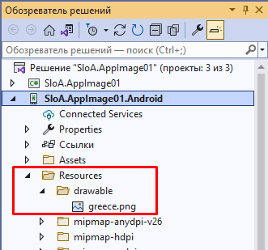
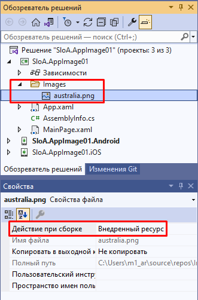

## Изображения в Xamarin.Forms

Документация: [Статья](https://docs.microsoft.com/ru-ru/xamarin/xamarin-forms/user-interface/images?tabs=windows#local-images), [Image](https://docs.microsoft.com/ru-RU/dotnet/api/xamarin.forms.image), [ImageSource](https://docs.microsoft.com/ru-RU/dotnet/api/xamarin.forms.imagesource?view=xamarin-forms).


Изображения могут загружаться из локального файла, внедренного ресурса, скачанного или загруженного из потока.


### Локальные образы

Файлы изображений можно добавлять в каждый проект приложения и ссылаться из Xamarin.Forms общего кода. Этот метод распространения является обязательным для изображений, специфических для платформы, например при использовании разных разрешений на различных платформах или немного разных вариантах изображения.

Чтобы использовать один образ во всех приложениях, *на каждой платформе необходимо использовать* одно и то же имя файла, которое должно быть допустимым именем ресурса Android (т. е. только строчные буквы, цифры, символ подчеркивания и период).

Недопустимые имена: "вода front.png", "WaterFront.png", "water-front.png" и "wåterfront.png"



Соблюдение правил для именования и размещения файлов позволяет следующему XAML загрузить и отобразить изображение на всех платформах:

```xaml
<?xml version="1.0" encoding="utf-8" ?>
<ContentPage xmlns="http://xamarin.com/schemas/2014/forms"
             xmlns:x="http://schemas.microsoft.com/winfx/2009/xaml"
             x:Class="SloA.AppImage01.MainPage">

    <Image Source="greece.png" />

</ContentPage>
```

Эквивалентный код C# выглядит следующим образом:

```c#
using Xamarin.Forms;
namespace SloA.AppImage01
{
    public partial class MainPage : ContentPage
    {
        public MainPage()
        {
           Content = new Image { Source = "greece.png" };
        }
    }
}
```

либо:

```c#
var image = new Image();
image.Source = ImageSource.FromFile("greece.png");
Content = image;
```


### Внедренные изображения

Внедренные изображения также поставляются вместе с приложением (например, локальными изображениями), но вместо копии изображения в структуре файлов каждого приложения файл изображения внедряется в сборку в качестве ресурса. Этот метод распространения изображений рекомендуется, когда на каждой платформе используются идентичные изображения и они особенно подходят для создания компонентов, так как изображение объединяется с кодом.

Для изображения необходимо задать **действие при сборке: EmbeddedResource**.



Код для загрузки внедренного изображения просто передает **идентификатор** ресурса в метод, как показано ниже:

```c#
using Xamarin.Forms;

namespace SloA.AppImage01
{
    public partial class MainPage : ContentPage
    {
        public MainPage()
        {
            Content = new Image { Source = ImageSource.FromResource("SloA.AppImage01.Images.australia.png") };
        }
    }
}

```

Или так:

```c#
Content = new Image { Source = ImageSource.FromResource("SloA.AppImage01.Images.australia.png", typeof(MainPage).GetTypeInfo().Assembly) };
```

`SloA.AppImage01.Images.australia.png` это идентификатор ресурса, собирается путем сцепления **пространства имен по умолчанию** для этого проекта с именем файла, используя точку (.) между значениями. Если внедренные изображения помещаются в папки в проекте, имена папок также разделяются точками (.) .

В настоящее время неявное преобразование идентификаторов ресурсов не предусмотрено. Вместо этого для загрузки внедренных изображений необходимо использовать `ImageSource.FromResource` или `new ResourceImageSource()` .


#### Расширение разметки XAML

Поскольку нет встроенного преобразователя типов из `string` в `ResourceImageSource` , эти типы изображений не могут быть загружены в собственном коде XAML. Вместо этого для загрузки изображений с помощью **идентификатора ресурса** , УКАЗАННОГО в XAML, можно написать простое расширение разметки XAML.

```c#
using System;
using System.Reflection;
using Xamarin.Forms;
using Xamarin.Forms.Xaml;

namespace SloA.AppImage01
{
    [ContentProperty(nameof(Source))]
    public class ImageResourceExtension : IMarkupExtension
    {
        public string Source { get; set; }

        public object ProvideValue(IServiceProvider serviceProvider)
        {
            if (Source == null)
            {
                return null;
            }

            var imageSource = ImageSource.FromResource(Source, typeof(ImageResourceExtension).GetTypeInfo().Assembly);

            return imageSource;
        }
    }
}
```


```xaml
<?xml version="1.0" encoding="utf-8" ?>
<ContentPage xmlns="http://xamarin.com/schemas/2014/forms"
             xmlns:x="http://schemas.microsoft.com/winfx/2009/xaml"
             xmlns:local="clr-namespace:SloA.AppImage01;assembly=SloA.AppImage01"
             x:Class="SloA.AppImage01.MainPage">

    <Image Source="{local:ImageResource SloA.AppImage01.Images.australia.png}" />

</ContentPage>
```


```c#
using Xamarin.Forms;

namespace SloA.AppImage01
{
    public partial class MainPage : ContentPage
    {
        public MainPage()
        {
            InitializeComponent();
        }
    }
}

```


### Загрузка изображений

Образы могут быть автоматически скачаны для отображения, как показано в следующем коде XAML:

```xaml
<?xml version="1.0" encoding="utf-8" ?>
<ContentPage xmlns="http://xamarin.com/schemas/2014/forms"
             xmlns:x="http://schemas.microsoft.com/winfx/2009/xaml"
             x:Class="SloA.AppImage01.MainPage">

    <Image Source="https://aka.ms/campus.jpg" />

</ContentPage>
```

Эквивалентный код C# выглядит следующим образом:

```c#
using System;
using Xamarin.Forms;

namespace SloA.AppImage01
{
    public partial class MainPage : ContentPage
    {
        public MainPage()
        {
            var webImage = new Image
            {
                Source = ImageSource.FromUri(
                    new Uri("https://aka.ms/campus.jpg")
                    )
            };
            Content = webImage;
        }
    }
}

```

ImageSource.FromUri метод требует наличия Uri объекта и возвращает новый UriImageSource объект, который считывает из Uri .

Также существует неявное преобразование для строк URI, поэтому в следующем примере также будет работать:

```c#
webImage.Source = "https://aka.ms/campus.jpg";
```


#### Кэширование скачанных образов

[`UriImageSource`](https://docs.microsoft.com/ru-RU/dotnet/api/xamarin.forms.uriimagesource) Также поддерживает кэширование скачанных образов, настроенных с помощью следующих свойств:

- [`CachingEnabled`](https://docs.microsoft.com/ru-RU/dotnet/api/xamarin.forms.uriimagesource.cachingenabled#xamarin-forms-uriimagesource-cachingenabled) — Включено ли кэширование ( `true` по умолчанию).
- [`CacheValidity`](https://docs.microsoft.com/ru-RU/dotnet/api/xamarin.forms.uriimagesource.cachevalidity#xamarin-forms-uriimagesource-cachevalidity) — Значение типа `TimeSpan` , определяющее, как долго образ будет храниться локально.

Кэширование включено по умолчанию и будет хранить образ локально в течение 24 часов. Чтобы отключить кэширование для конкретного образа, создайте экземпляр источника образа следующим образом:

```c#
image.Source = new UriImageSource { CachingEnabled = false, Uri = new Uri("https://server.com/image") };
```

Чтобы задать определенный период кэширования (например, 5 дней), создайте экземпляр источника образа следующим образом:

```c#
webImage.Source = new UriImageSource
{
    Uri = new Uri("https://aka.ms/campus.jpg"),
    CachingEnabled = true,
    CacheValidity = new TimeSpan(5,0,0,0)
};
```

Встроенное кэширование упрощает поддержку таких сценариев, как прокручиваемые списки изображений, где можно задать (или привязать) изображение в каждой ячейке и позволить встроенному кэшу позаботиться о повторной загрузке изображения при прокрутке ячейки обратно в представление.


## Примеры


### Привязки  + конвертация

Необходимо отобразить **внедренное изображение** с помощью привязки.

```c#
using Xamarin.Forms;
using SloA.AppImage01.Model;

namespace SloA.AppImage01
{
    namespace Model
    {
        public class Country
        {
            public string Name { get; set; }
            public string ImageUrl { get; set; }
        }
    }

    public partial class MainPage : ContentPage
    {
        public MainPage()
        {
            InitializeComponent();

            BindingContext = new Country() {
                Name = "Australia",
                ImageUrl = "SloA.AppImage01.images.australia.png" };

        }
    }
}

```

Разметка XAML. Создаем экземпляр преобразователя в словаре ресурсов и применяем его в привязке используя свойство `Converter` :

```xaml
<?xml version="1.0" encoding="utf-8" ?>
<ContentPage xmlns="http://xamarin.com/schemas/2014/forms"
             xmlns:x="http://schemas.microsoft.com/winfx/2009/xaml"
             xmlns:data="clr-namespace:SloA.AppImage01.Model;assembly=SloA.AppImage01"
             xmlns:cvt="clr-namespace:SloA.AppImage01"
             x:Class="SloA.AppImage01.MainPage">

    <ContentPage.Resources>
        <ResourceDictionary>
            <cvt:EmbeddedImageConverter x:Key="irConverter" ResolvingAssemblyType="{x:Type data:Country}" />
        </ResourceDictionary>
    </ContentPage.Resources>

    <StackLayout Padding="10">
       
        <StackLayout Orientation="Horizontal" VerticalOptions="Center" HorizontalOptions="Center">
            <Label Text="Country:" VerticalOptions="Center" />
            <Entry Text="{Binding Name}" />
        </StackLayout>

        <Image HeightRequest="150"
                Source="{Binding ImageUrl, Mode=OneWay, Converter={StaticResource irConverter}}" />

    </StackLayout>

</ContentPage>
```

Реализация конвертора, интерфейс `IValueConverter`:

```c#
using System;
using System.Globalization;
using System.Reflection;
using Xamarin.Forms;

namespace SloA.AppImage01
{
    public class EmbeddedImageConverter : IValueConverter
    {
        public Type _resolvingAssemblyType;
        public Type ResolvingAssemblyType
        {
            get
            {
                return _resolvingAssemblyType;
            }
            set
            {
                _resolvingAssemblyType = value;
            }
        }

        public object Convert(object value, Type targetType, object parameter, CultureInfo culture)
        {
            var imageUrl = (value ?? "").ToString();
            if (string.IsNullOrEmpty(imageUrl))
            {
                return null;
            }

            var imageSource = ImageSource.FromResource(imageUrl, ResolvingAssemblyType?.GetTypeInfo().Assembly);

            return imageSource;
        }

        public object ConvertBack(object value, Type targetType, object parameter, CultureInfo culture)
        {
            throw new NotImplementedException();
        }
    }
}
```

