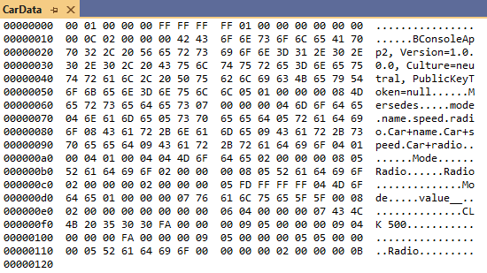

## Сериализация

Сериализация представляет собой процесс передачи состояния объекта в поток байтов с целью сохранения его в памяти, в базе данных или в файле.

Основное назначение сериализации - сохранить состояние объекта для того, чтобы иметь возможность восстановить его в случае необходимости.

Процесс обратной сериализации называется десериализация.

Межпроцессорная, междоменная и межуровневая сериализация-десериализация, называется маршалингом-демаршалингом.


### XML

Для сериализации доступны только открытые поля и свойства.

```c#
using System.Drawing;
using System.Xml.Serialization;

class Program
{
    static void Main()
    {
        MyClass instance1 = new MyClass();
        for (int i = 0; i < 10; i++)
            instance1.Items.Add($"Element {i}");

        // Тип для Сериализации и Десериализации
        XmlSerializer serializer = new XmlSerializer(typeof(MyClass));
        
        // Сериализация
        FileStream stream = new FileStream("Serialization.xml", FileMode.Create, FileAccess.Write);
        
        // Сохраняем объект в XML-файле на диске
        serializer.Serialize(stream, instance1);
        stream.Close();

        // Десериализация
        MyClass instance2;
        
        try
        {
            stream = new FileStream("Serialization.xml", FileMode.Open, FileAccess.Read);
            
            // Восстанавливаем объект из XML-файла
            instance2 = serializer.Deserialize(stream) as MyClass;

            Console.WriteLine($"ID      : {instance2.ID}");
            Console.WriteLine($"Size    : {instance2.Size}");
            Console.WriteLine($"Position: {instance2.Position}");
            Console.WriteLine("List");

            foreach (string item in instance2.Items)
            {
                Console.WriteLine(item);
            }
        }
        catch (Exception ex)
        {
            Console.WriteLine(ex.Message);
        }
    }
}

public class MyClass
{
    private string id = "button";
    private int size = 10;
    private Point position = new Point(20, 30);
    private string password = "123456_password";
    private List<string> items = new List<string>();

    public string name = "MyClass";

    public string ID
    {
        get { return id; }
        set => id = value;
    }
    public int Size
    {
        get { return size; }
        set => size = value;
    }

    public Point Position
    {
        get { return position; }
        set => position = value;
    }

    public string Password
    {
        get { return password; }
        set => password = value;
    }

    public List<string> Items
    {
        get { return items; }
        set => items = value;
    }
}
```

Результат сериализации:

```xml
<?xml version="1.0" encoding="utf-8"?>
<MyClass
	xmlns:xsi="http://www.w3.org/2001/XMLSchema-instance"
	xmlns:xsd="http://www.w3.org/2001/XMLSchema">
	<name>MyClass</name>
	<ID>button</ID>
	<Size>10</Size>
	<Position>
		<X>20</X>
		<Y>30</Y>
	</Position>
	<Password>123456_password</Password>
	<Items>
		<string>Element 0</string>
		<string>Element 1</string>
		<string>Element 2</string>
		<string>Element 3</string>
		<string>Element 4</string>
		<string>Element 5</string>
		<string>Element 6</string>
		<string>Element 7</string>
		<string>Element 8</string>
		<string>Element 9</string>
	</Items>
</MyClass>
```


К сериализуемым данным можно добавлять атрибуты xml сериализации:

```c#
// Переименовывает корневой узел
[XmlRoot("MyButton")]
public class MyClass
{
    private string id = "button";
    private int size = 10;
    private Point position = new Point(20, 30);
    private string password = "123456_password";
    private List<string> items = new List<string>();

    public string name = "MyClass";

    public MyClass()
    {
        Console.WriteLine("ctor");
    }

    // Переименовываем и делаем атрибутом
    [XmlAttribute("SerialID")]
    public string ID
    {
        get { return id; }
        set => id = value;
    }

    [XmlAttribute("Lenght")]
    public int Size
    {
        get { return size; }
        set => size = value;
    }

    // Переименовываем XML элемент
    [XmlElement("Pos")]
    public Point Position
    {
        get { return position; }
        set => position = value;
    }

    // Исключаем свойство из процесса сериализации
    [XmlIgnore]
    public string Password
    {
        get { return password; }
        set => password = value;
    }

    // Характеристика массива
    [XmlArray("List")]
    // Характеристика каждого элемента массива
    [XmlArrayItem("Element")]
    public List<string> Items
    {
        get { return items; }
        set => items = value;
    }
}
```

Результат:

```xml
<?xml version="1.0" encoding="utf-8"?>
<MyButton
	xmlns:xsi="http://www.w3.org/2001/XMLSchema-instance"
	xmlns:xsd="http://www.w3.org/2001/XMLSchema" SerialID="button" Lenght="10">
	<name>MyClass</name>
	<Pos>
		<X>20</X>
		<Y>30</Y>
	</Pos>
	<List>
		<Element>Element 0</Element>
		<Element>Element 1</Element>
		<Element>Element 2</Element>
		<Element>Element 3</Element>
		<Element>Element 4</Element>
		<Element>Element 5</Element>
		<Element>Element 6</Element>
		<Element>Element 7</Element>
		<Element>Element 8</Element>
		<Element>Element 9</Element>
	</List>
</MyButton>
```


### Binary (Бинарная сериализация)

Что бы класс стал доступен для сериализации, необходимо пометить его атрибутом `[Serializable]`.

```c#
using System.Runtime.Serialization.Formatters.Binary;

class Program
{
    static void Main()
    {
        Mersedes auto = new Mersedes("CLK 500", 250, Mode.Lux);
        auto.TurnOnRadio(true);
        auto.ShowMode();

        FileStream stream = File.Create("CarData.dat");

        BinaryFormatter formatter = new BinaryFormatter();

        formatter.Serialize(stream, auto);
        stream.Close();

        stream = File.OpenRead("CarData.dat");

        auto = formatter.Deserialize(stream) as Mersedes;

        Console.WriteLine("Имя     :" + auto.Name);
        Console.WriteLine("Скорость:" + auto.Speed);
        auto.TurnOnRadio(false);
        stream.Close();
    }
}

[Serializable]
class Mersedes : Car
{
    protected Mode mode;

    public Mersedes(string name, int speed, Mode mode)
        : base(name, speed)
    {
        this.mode = mode;
    }

    public void SetMode(Mode mode)
    {
        this.mode = mode;
        Console.WriteLine(this.mode);
    }

    public void ShowMode()
    {
        Console.WriteLine(this.mode);
    }
}

[Serializable]
class Car
{
    protected string name;
    protected int speed;
    protected Radio radio;

    public Car(string name, int speed)
    {
        this.name = name;
        this.speed = speed;
        radio = new Radio();
    }

    public string Name
    {
        get { return name; }
        set { name = value; }
    }

    public int Speed
    {
        get { return speed; }
        set { speed = value; }
    }

    public void TurnOnRadio(bool state)
    {
        this.radio.OnOff(state);
    }
}

[Serializable]
class Radio
{
    [NonSerialized]
    private int id = 9;
    public void OnOff(bool state)
    {
        Console.WriteLine(state ? "Радио Включено." : "Радио Выключено.");
    }
}

enum Mode
{
    Lux, Sport
}
```

Результат сериализации:




### SOAP

Устаревший формат, ныне не используется. Создает файл xml.

```c#
using System.Runtime.Serialization.Formatters.Soap;
...
```


### Пользовательская сериализация

Позволяет реализовать избирательную сериализацию. 

Необходимо реализовать интерфейс `ISerializable` и специальный вариант конструктора:

```c#
using System.Runtime.Serialization;

[Serializable]
class Car : ISerializable
{
    public string name;
    public int speed;

    public Car(string name, int speed)
    {
        this.name = name;
        this.speed = speed;
    }

    private Car(SerializationInfo propertyBag, StreamingContext context)
    {
        Console.WriteLine("[ctor] ContentState: {0}", context.State.ToString());

        name = propertyBag.GetString("name");
        speed = propertyBag.GetInt32("speed");
    }

    public string Name
    {
        get { return name; }
        set { name = value; }
    }

    public int Speed
    {
        get { return speed; }
        set { speed = value; }
    }

    // Метод вызывается Formatter-ом
    void ISerializable.GetObjectData(SerializationInfo propertyBag, StreamingContext context)
    {
        Console.WriteLine("[GetObjectData] ContentState: {0}", context.State.ToString());

        propertyBag.AddValue("name", name);
        propertyBag.AddValue("speed", speed);
    }
}
```

```c#
using System.Runtime.Serialization.Formatters.Binary;

class Program
{
    static void Main()
    {
        Car auto = new Car("CLK 500", 250);

        FileStream stream = File.Create("CarData.dat");

        BinaryFormatter formatter = new BinaryFormatter();

        formatter.Serialize(stream, auto);
        stream.Close();

        stream = File.OpenRead("CarData.dat");

        auto = formatter.Deserialize(stream) as Car;

        Console.WriteLine("Имя     :" + auto.Name);
        Console.WriteLine("Скорость:" + auto.Speed);
        
        stream.Close();
    }
}
```


После десериализации, при реализации интерфейса `IDeserializationCallback`, Formatter-ом будет вызван метод `OnDeserialization` в котором можно выполнить пользовательские вычисления/преобразования.

При добавлении в класс нового поля, это поле необходимо помечать атрибутом `[OptionalField]`, при десериализации старых версий данных, оно будет инициализировано значением по умолчанию.


#### Атрибуты демаркации

- `[OnSerializing]` - до сериализации
- `[OnSerialized]` - после сериализации
- `[OnDeserializing]` - до десериализации
- `[OnDeserialized]` - после десериализации

Метод должен содержать параметр `StreamingContext`.
